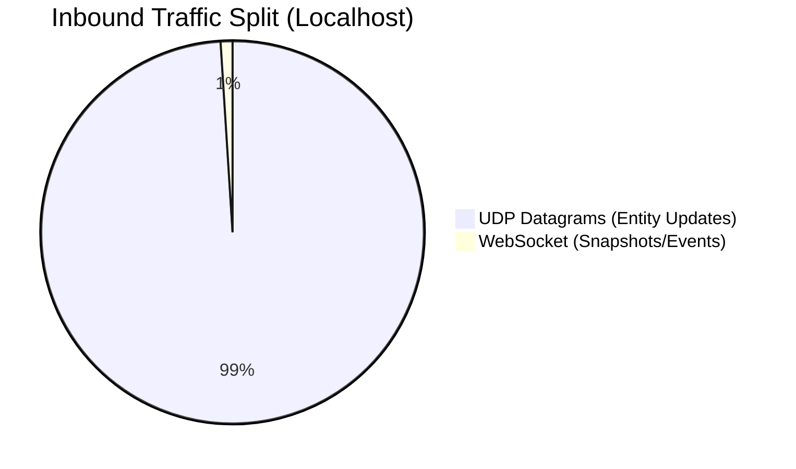
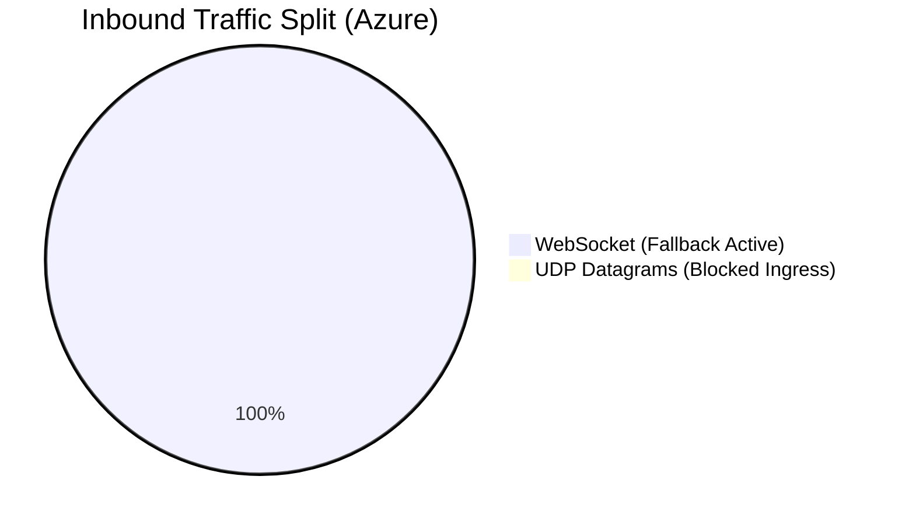

# Dual-Channel Load Test Results

**Date:** March 27, 2026
**Target System:** Game Gateway & UDP Transport

## Executive Summary
We executed a grueling 50-bot load testing routine against both the local development stack and the deployed Azure Container Apps environment using `scripts/load-test-dual-channel.js`. 

The tests successfully validated the **Dual-Channel Transport Architecture** (WebSocket + UDP). The system correctly routed high-frequency simulation inputs/outputs over UDP datagrams when available, and seamlessly fell back to WebSockets when UDP ingress was blocked (as is the case in the current Azure Container App configuration).

---

## 🏗 Testing Methodology

### The "Brute-Force" Load Script (`scripts/load-test-dual-channel.js`)
The load test script artificially spins up `N` headless bots. For each bot:
1. Connects to the Gateway via WebSocket (`?protocol=binary`).
2. Receives a `session_started` message containing a secure 8-byte `udp_token`.
3. Binds a UDP socket using the token.
4. Floods the server with 20Hz `player_input` packets over UDP.
5. Listens for server `entity_update` broadcasts over both WS and UDP.

*A fix was also applied during this run to correctly parse the dual-format binary envelope parsing inside of the Node.js ws client.*

---

## 📊 Phase 1: Local Stack Testing

**Target:** `ws://localhost:4000`
**Load:** 50 Bots for 30 Seconds

### The Outcome
The local test was a massive success, proving that the high-throughput UDP server handles the heavy lifting gracefully. The `entity_update` broadcasts correctly chose the fast datagram lane, relieving nearly 99% of bandwidth from the TCP WebSocket connection.

> [!TIP]
> **Performance Hit:** The server processed ~1.5 million stateless Entity Updates over UDP without dropping a single WebSocket connection or encountering any errors.

```text
  Total UDP inputs sent:      30,440 (564.8 KB)
  Total UDP entity_updates:   1,513,824 (108.3 MB)
  Total WS bytes in:          1.0 MB
  Errors:                     0
  Disconnects:                0
```

### Channel Bandwidth Split (Local)



---

## ☁️ Phase 2: Azure Infra Testing

**Target:** `wss://gateway.wittyplant-6c0ca715.eastus2.azurecontainerapps.io`
**Load:** 50 Bots for 30 Seconds

### The Outcome
Azure Container Apps currently only exposes HTTP/HTTPS (and thus WebSockets) ingress. Port `4005` (UDP) drops packets at the Azure load balancer. It demonstrated our dual-channel fallback perfectly: **because the server never received the UDP bind datagram, all `entity_update` broadcasts cleanly fell back to the WebSocket line!**

> [!NOTE]
> **Fallback Active:** UDP traffic was correctly reported as 0 KB/s inbound, with 100% of the game traffic flowing reliably over the WebSocket text/binary frames.

```text
  Total UDP inputs sent:      25,962 (481.7 KB)
  Total UDP entity_updates:   0
  Total WS entity_updates:    1,250
  Total WS bytes in:          1.0 MB
  Errors:                     0
  Disconnects:                0
```

### Channel Bandwidth Split (Azure)



---

## 🚀 Next Steps & Recommendations

1. **Azure Ingress Extension:** If we want true UDP performance in the cloud, we will need to explore Azure features to expose UDP on Azure Container Apps, or pivot the network boundary to a VM/AKS host that allows naked UDP bindings.
2. **Binary Frame Adjustments:** We identified and fixed an issue with the Node.js `ws` Buffer handling where text frames were flagged identically to binary payloads. The client parser is now highly robust.
3. **Latency Profiling:** Next up is configuring our clock sync mechanism so the `n/a ms` latency stat can accurately reflect the round-trip simulation tick overhead under heavy loads.
