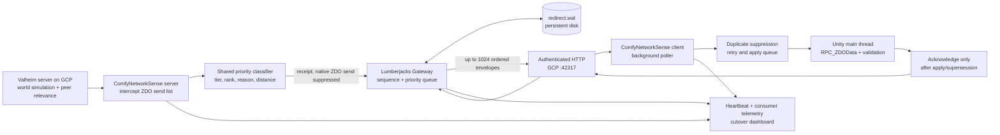

# Valheim + Lumberjacks P7 network overview

Status: single-client authoritative-priority victory, 2026-07-16 UTC.

This is the canonical map of the live P7 deployment. The matching run record is
`C:\work\comfy\fieldlab\runs\20260716-011112-valheim-lumberjacks-authoritative-priority-cutover\report.md`.
It complements the general [network architecture](architecture.md),
[interest-management](interest-management.md), and [evidence index](evidence-index.md).

## The victory, stated precisely

An enrolled Valheim client joined the real `ComfyEra16` server on GCP and received
the complete tested ZDO replication window through Lumberjacks:

| Gate | Result |
|---|---:|
| Session | `20260716-011112-f7e72fb4` |
| Mode / window | `lumberjacks-primary` / `p7-primary-v1` |
| Gateway receipts | 83,220 |
| Client acknowledgements | 83,220 |
| Pending at closure | 0 |
| Priority tagged | 83,220 (100%) |
| Fast-lane applications | 47,534 (57.1%) |
| Applied / safely superseded | 72,946 / 10,274 |
| Native-only ZDO traffic | 0 |
| Rejects / duplicates / retries | 0 / 0 / 0 |
| Poll / ack / telemetry failures | 0 / 0 / 0 |
| Maximum client queue | 960 envelopes |
| Peer-ready to first apply | 6.72 seconds |
| Peer-ready to complete | 102.11 seconds |
| Final acceptance sample | 121.2 FPS; p95 frame 8.5 ms |

The player then flew rapidly into previously unvisited terrain and reported that
tree pop-in kept pace impressively. That observation is useful experience evidence;
the counters above are the authority evidence.

This is a **100% ZDO delivery cutover for the observed single-client window**. It
does not mean that Lumberjacks has replaced Steam login, Valheim simulation,
Valheim's construction of the per-peer relevance list, or every non-ZDO RPC.

## Hosts and live endpoints

| Host | Runs | Role / exposure |
|---|---|---|
| **GCP `comfy-lumberjacks-p7`** | Valheim dedicated server, Lumberjacks Gateway, EventLog, Progression, Operator API, PostgreSQL | Valheim UDP `8.231.129.249:2456`; trusted-pilot Gateway HTTP `8.231.129.249:42317`; internal services otherwise loopback/container-only. |
| **Persistent disk `/mnt/comfy-p7`** | `ComfyEra16` world, enrollment store, `redirect.wal`, deployment backups | Durable state. A second server must never write the same world lineage concurrently. |
| **OMEN** | Native Valheim client, BepInEx, `ComfyNetworkSense 0.5.31`, fieldlab/MCP operator tools | Renders the game and consumes the authoritative queue. It connects directly to the authenticated Gateway; no SSH tunnel or OMEN poller process is in the gameplay path. |
| **Steam / native Valheim** | Authentication, server connection, peer lifecycle, simulation, native relevance selection | Compatibility substrate. A successful Steam join alone is not proof of Lumberjacks authority. |

The Gateway's public pilot listener is plain HTTP. Its authoritative Valheim paths
require a per-enrollment credential, but TLS, rate limiting, and dashboard access
control are not yet installed. Treat the IP/port deployment as a limited volunteer
pilot, not an Internet-hardened service.

## End-to-end authoritative dataflow



The server adapter deliberately starts with Valheim's own peer-specific sync list.
It preserves the native list order, attaches the shared FieldLab priority metadata,
posts every selected ZDO to the Gateway, and suppresses its native ZDO delivery in
primary mode. The Gateway returns pending records ordered by priority rank, distance,
then sequence while retaining reliable WAL-backed delivery for every tier.

The client polls off Unity's background path, queues envelopes, and marshals no more
than 64 applications per Unity update. It invokes `RPC_ZDOData` on the main thread,
validates the result, suppresses duplicates, and acknowledges only successful or
safely superseded sequences. An interrupted client therefore leaves durable pending
work rather than manufacturing a successful acknowledgement.

## Authority boundary

| Concern | Owner now |
|---|---|
| World simulation and save files | Valheim dedicated server |
| Steam identity, login, base peer connection | Steam / Valheim |
| Candidate ZDO relevance list for each peer | Valheim, before the adapter intercept |
| ZDO priority classification | Shared ComfyNetworkSense / FieldLab classifier |
| ZDO sequencing, durable delivery, ordering, acknowledgement | Lumberjacks Gateway |
| ZDO application and validation | ComfyNetworkSense client on Unity main thread |
| Enrollment credential | Lumberjacks one-time Steam invite and file-backed enrollment store |
| Operator observation | Gateway dashboards, telemetry API, FieldLab and MCP |

## How we got here

1. FieldLab first observed real Era16 density and classified 11,544 object rows over
   six route stops without changing native replication.
2. The priority-manifest and gateway-plan runs proved the classifier and ordered
   side-channel contracts independently of gameplay authority.
3. Redirect tests proved exact server interception, native suppression, durable
   receipt equality, and client `RPC_ZDOData` injection.
4. The authoritative consumer gained a background poller, Unity main-thread
   dispatch, readback validation, success-only acknowledgement, retry, duplicate
   suppression, timeout handling, and telemetry.
5. The FieldLab classifier was moved into the production redirect path. The Gateway
   gained a 1,024-envelope priority-ordered pending response; the client polls and
   acknowledges batches of 1,024 while retaining a 64-apply Unity frame budget.
6. Primary redirect startup moved to peer readiness, removing the old fixed delay.
7. Steam invite redemption issued per-player enrollment IDs and access tokens, so
   OMEN could use the shared GCP endpoint without a player-specific SSH tunnel.
8. Deployment was made hash-verifiable and rollback-backed. The live WAL was
   compacted from 168,987,408 to 256,244 bytes before the clean gate.
9. The first live priority session revealed two recoverable HTTP connection resets.
   A fresh Valheim process then produced the clean zero-failure victory window above.

## Current bottlenecks and next proof

1. **Global window, not recipient-scoped queues.** The current P7 queue is shared.
   Do not widen past the trusted single-client gate until envelopes and acknowledgements
   are scoped per enrolled consumer/Steam identity and two clients can drain without
   stealing each other's work.
2. **Join burst.** The clean window took 102.11 seconds from peer readiness to full
   closure, although the first ZDO applied in 6.72 seconds and priority content arrived
   first. Measure time-to-playable separately from time-to-complete and optimize both.
3. **Native relevance cost.** Lumberjacks orders and delivers the result, but Valheim
   still constructs the source sync list. Moving interest selection earlier can reduce
   server/mod work after correctness is preserved.
4. **HTTP pilot transport.** Polling works and the clean session had zero failures,
   but persistent authenticated HTTPS or another framed transport will reduce setup,
   connection churn, and exposure before a public rollout.
5. **WAL lifecycle.** Compaction is effective but still operator-driven. Add bounded
   automatic compaction, free-space alarms, and restart/replay soak evidence.
6. **Capacity and right-sizing.** `n2-highmem-8` has large single-client headroom.
   Capture CPU, memory, disk, bandwidth, queue slope, frame time, and cost at two and
   then increasing real-client counts before downsizing or making a population claim.

## Acceptance rule

A primary test passes only when the same window shows:

```text
mode = lumberjacks-primary
coverage_percent = 100
coverage_native_only = 0
native_fallbacks = 0
receipts = acknowledged
pending = 0
complete = true
rejected = duplicates = retried = 0
client poll_failures = ack_failures = telemetry_failures = 0
```

Preserve the sample before a disconnect or new window resets live receipt counters.
The server heartbeat continuing after a client leaves is expected; heartbeat freshness
and consumer completion are separate clocks.

## Evidence and operations

- Versioned victory evidence:
  `C:\work\comfy\fieldlab\evidence\p7-primary-v1-authoritative-priority-zdo-20260716-v0531.md`.
- Victory report and snapshot:
  `C:\work\comfy\fieldlab\runs\20260716-011112-valheim-lumberjacks-authoritative-priority-cutover\`.
- Release manifest:
  `C:\work\comfy\fieldlab\runs\releases\p7-primary-v1-0.5.31-clean.json`.
- P7 deployment and reproduction runbook:
  `C:\work\comfy\infra\gcp\p7\README.md`.
- Volunteer enrollment runbook:
  `C:\work\comfy\infra\gcp\p7\VOLUNTEER-ENDPOINT.md`.
- Raw OMEN client telemetry:
  `C:\Program Files (x86)\Steam\steamapps\common\Valheim\BepInEx\config\comfy-network-sense\telemetry-client.jsonl`.
- Governing evidence rules: [network evidence index](evidence-index.md).
