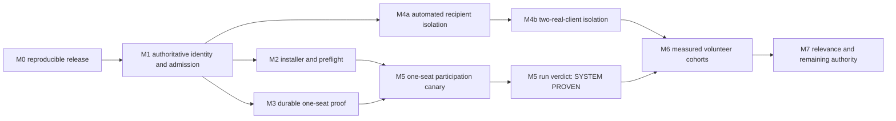
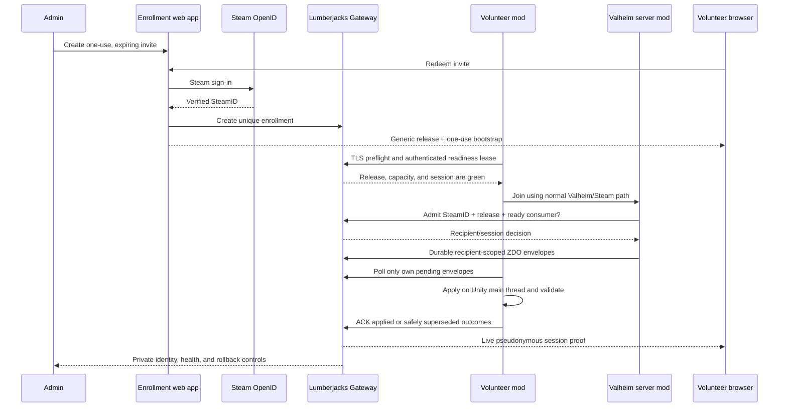

# Valheim volunteer cutover platform plan

Status: proposed execution plan
Date: 2026-07-15 America/Los_Angeles
Applies to: Lumberjacks Gateway, the ComfyNetworkSense Valheim mod, the GCP
`ComfyEra16` test server, and `C:\work\comfy\fieldlab`

## Outcome

Turn the proven one-client P7 cutover into a repeatable volunteer platform that:

1. admits only invited Steam accounts;
2. installs and verifies the exact compatible client without hand-editing config;
3. never starts a volunteer session while the deployment is already unhealthy;
4. shows, per participant, that eligible ZDO traffic traversed Lumberjacks and was
   applied by that participant's Valheim client;
5. retains a sanitized evidence packet and a short experience report for every run;
6. rolls back explicitly and safely when a strict cutover cannot continue; and
7. widens from one volunteer to several only after recipient isolation is proved.

The immediate product is a reliable volunteer experience, not another synthetic
benchmark. The longer-term product is a migration path from Valheim-selected ZDO
delivery to Lumberjacks-owned relevance, inference, ownership, and eventually the
remaining game data plane.

## Sixty-second orientation

Valheim represents persistent replicated world objects—buildings, trees, creatures,
terrain changes, and similar state—as **ZDOs**. In the proven P7 experiment, Valheim
still chose which ZDO revisions were relevant to the connected player; the server mod
redirected those selected revisions into the Lumberjacks Gateway, the enrolled client
mod applied them on Unity's main thread, and the client durably acknowledged the
result.

```text
Valheim server selects a peer's eligible ZDO revisions      [native relevance]
  -> ComfyNetworkSense server mod redirects them
  -> Lumberjacks Gateway durably stores and orders them
  -> enrolled ComfyNetworkSense client polls them
  -> Unity main thread applies or safely supersedes them
  -> client durably acknowledges the terminal outcome

Steam login + base peer transport + simulation + non-ZDO RPCs remain native today.
```

The current `100%` claim has a precise denominator: **83,220 of 83,220 ZDO
revisions selected as eligible during one named strict, single-client P7 window were
durably received and terminally acknowledged through Lumberjacks; pending and
eligible native-only sends were both zero.** It is not a claim about 100% of packets,
RPCs, simulation, or all objects in the world.

| Term | Meaning here |
|---|---|
| P7 | The GCP `ComfyEra16` Valheim + Gateway proof deployment and its phased cutover program |
| ZDO | Valheim's replicated persistent world-object record |
| eligible revision | A ZDO revision selected by Valheim's peer-specific sync list during the measured window |
| all-prefab | Every eligible prefab class in the observed window (`*`), not every object that exists in the save |
| recipient | Opaque Gateway delivery identity derived from one enrolled Steam account; the client cannot choose it |
| readiness lease | Short-lived proof that this exact client process has compatible code, credentials, and consumer capability |
| strict window | A named run in which eligible ZDO delivery must use Lumberjacks or fail visibly; silent mixed fallback is not success |
| durable | Accepted into recoverable Gateway storage before the producer treats delivery as safely handed off |
| inference / relevance | The judgment of which world state a player should receive; this is not machine-learning inference |

## Volunteer success contract

The platform is successful when an invited volunteer can complete this loop without
private coaching or wondering whether their time produced useful evidence:

```text
receive invite
  -> understand the experiment, requested exercise, duration, and risks
  -> sign in with Steam and receive a personal setup package
  -> install and pass preflight without hand-editing configuration
  -> join the scheduled run and see LUMBERJACKS ACTIVE
  -> follow one or more visible test cards while watching personal traffic proof
  -> submit the short observation report
  -> receive a retained PARTICIPATION COMPLETE receipt
```

Joining the server is not completion. A heartbeat is not traffic proof. Completion
requires evidence that the participant used the declared release in the intended run,
received qualifying Lumberjacks traffic, completed or attempted the assigned test,
and returned the bounded result/observation packet.

Participation success and system verdict are deliberately separate:

- **Participation complete** means the volunteer performed the requested work and the
  platform retained a usable packet. Finding a defect is successful participation.
- **System verdict: PROVEN** means the networking correctness gates closed.
- **System verdict: DEGRADED** means the volunteer produced useful evidence of a
  fallback, error, performance problem, or failed invariant.
- **System verdict: INCONCLUSIVE** means the session did not produce enough qualifying
  traffic or evidence. The receipt explains exactly what was missing.

The volunteer dashboard therefore has three states in one continuous page:

1. **Before the run:** enrollment, release, installation, Gateway/server readiness,
   capacity reservation, assigned test cards, expected duration, data collected,
   recovery instructions, and a clear `READY TO JOIN` gate.
2. **During the run:** pseudonym/run ID, `LUMBERJACKS ACTIVE` or recovery state,
   current test-card instruction, traffic deltas, received/applied/acknowledged/pending
   counts, queue age, and a one-click observation/problem marker.
3. **After the run:** `PARTICIPATION COMPLETE`, completed/attempted cards, system
   verdict, release and run identity, summarized traffic proof, submitted observations,
   sanitized evidence status, uninstall/support links, and thanks.

### Initial volunteer test cards

The invite selects a small, explicit subset. Each card states what to do, what to
notice, how long it should take, and what the instrumentation will prove.

| Card | Volunteer exercise | Typical time | Human observation | Instrumented result |
|---|---|---:|---|---|
| T01 Setup and first join | Redeem invite, install, preflight, create/select a backed-up character, and join | 10 min | Anything confusing, manual, or unexpectedly slow | Enrollment, release, readiness, admission, first apply |
| T02 Dense spawn arrival | Remain in the portal/building area until it is visually usable | 5 min | Missing art/buildings, severe pop-in, freeze, corruption | Priority-playable and complete-drain time, frame hitches |
| T03 Rapid frontier travel | Fly rapidly into a direction not previously visited | 10 min | Tree/terrain pop-in distance, stalls, movement responsiveness | Priority rate, queue slope/age, first-useful delivery |
| T04 Elaborate build revisit | Approach and circle a known complex construction | 10 min | Time to recognizable and then complete structure; incorrect pieces | Dense-object application, supersession, starvation, full closure |
| T05 Quiet drain | Stop in wilderness and wait without teleporting | 5 min | Late pop-in, pause, disconnect, or unexpected activity | Backlog drainage, oldest age, idle state, conservation closure |
| T06 Controlled reconnect | Disconnect/rejoin only when the operator assigns the card | 10 min | Lost state, duplicate objects, long blank screen, join friction | Resume, duplicate suppression, lease and outstanding delivery recovery |
| T07 Two-client isolation | Two assigned players occupy shared, then separated regions | 20 min | Cross-player stalls or inconsistent world state | Recipient isolation and independent queue closure; unavailable until M4b |

The test-card catalog is versioned. The dashboard records the exact card revision in
the run packet so an instruction cannot drift away from the metrics used to judge it.

### Participation receipt minimum

Every attempted scheduled run produces a personal, pseudonymous retained receipt with:

- run ID, participant alias, assigned/completed/attempted test cards, and timestamps;
- mod, Gateway, server, protocol, world epoch, and deployment hashes;
- whether enrollment, preflight, admission, readiness, and qualifying traffic occurred;
- received, applied, safely superseded, acknowledged, pending, native, and failure
  summaries for that recipient;
- participant observations and whether the diagnostic/survey packet was received;
- a separate participation status and system verdict with plain-language reasons; and
- support, privacy/deletion, character-recovery, and uninstall links.

The public research view may aggregate that receipt. The personal view contains no
reusable credential, and one volunteer cannot view another volunteer's identity or
recipient ledger.

## Decision

Run two work streams in parallel:

- **Volunteer experience:** release freeze, enrollment/admission, installer,
  preflight, dashboards, evidence capture, and a serialized one-seat pilot.
- **Multiplayer correctness:** recipient-scoped durable queues, per-peer readiness,
  loss-safe producer behavior, and a two-real-client isolation gate.

Do not wait for the multiplayer queue redesign before building the volunteer flow.
Do not allow two authoritative consumers at once until that redesign passes. Set the
strict-cutover capacity to one in the meantime.



Milestone numbers are stable identifiers, not a promise of strict serial execution.
After M1, M2, M3, and M4a may proceed in parallel. M5 requires both M2 and M3; M6
requires both the real-client M4b isolation result and an M5 run whose sealed system
verdict is `PROVEN`.

### Gate contract

Every milestone gate is a falsifiable acceptance contract, not a qualitative progress
statement. Before executing a gate, pin a versioned acceptance profile in the run
packet. For every predicate, that profile names:

- the exact release, topology, world epoch, participant count, and test window;
- the fixture or operator action that exercises it;
- the numeric threshold, time boundary, or required zero count;
- the automated verifier and its expected result; and
- the immutable evidence artifact that records the observation.

Words such as `fresh`, `compatible`, `bounded`, `healthy`, `acceptable`, and `tested`
are shorthand only. The pinned profile supplies their values. For example, freshness
is measured against the declared lease TTL; bounded queues have declared count, age,
and slope limits; persistence health has declared error and disk-headroom limits; and
acceptable QoL has declared route-relative performance and observation criteria.
`Actionable rejection` means a stable reason code plus safe remediation text.
`Rollback tested` means the declared last-known-good artifacts were restored and the
cold-start hash, preflight, and join checks passed.

A milestone is complete only when every predicate has retained validator output and
an immutable evidence link. Historic runs and design documents are **inputs**, not
exit evidence for new work. Evidence is described as **validated** unless a named
cryptographic signing mechanism and verifiable signature actually exist.

## What is already proved and should be reused

Do not rerun old phases merely to rediscover their result. Preserve and index them.

| Asset or claim | Existing evidence | How it is reused |
|---|---|---|
| Real Era16 density | `fieldlab/runs/20260704-080932-era16-density-pressure-matrix` models the 9.15-million-ZDO save and dense fixtures | Defines the quality route and scale fixtures |
| Validated native baseline | `fieldlab/runs/i1-airtight/20260710-p2baseline-{client,server}` | Comparison for client frame time and server behavior |
| I0-I7 behavior ladder | `fieldlab/evidence/` and the corresponding run packets | Regression suite; do not repeat the discovery work |
| All-prefab redirect and replay | `fieldlab/evidence/i7-live-w3-all-authoritative-zdo-20260714-v0525.md` | Gateway restart/replay correctness fixture |
| Current priority cutover | local `fieldlab/evidence/p7-primary-v1-authoritative-priority-zdo-20260716-v0531.md` | Validated single-client acceptance input; publication and immutable URL pinning are M0 work |
| Exact current artifact | `fieldlab/runs/releases/p7-primary-v1-0.5.31-clean.json` | Release-manifest schema and deployment verification input |
| Priority travel route | `fieldlab/runs/20260708-042303-valheim-lumberjacks-priority-load-order/` | Guided visual-quality test route |
| Run-packet automation | `fieldlab/scripts/run-experiment.ps1` and `validate-run-packet.ps1` | Basis of automatic session evidence |
| Live cutover sampler | `fieldlab/audits/p7-efficiency/sample-cutover.ps1` | Operator and packet collection building block |
| Performance analysis | `fieldlab/scripts/analyze-networksense-perf.ps1` | Post-run client performance report |
| Enrollment implementation | Steam OpenID invite redemption and client access middleware in the Gateway | Foundation for the hardened identity flow |

The current golden result is meaningful: one enrolled client closed 83,220 receipts
and acknowledgements, with 100% priority tags, zero native-only eligible sends, zero
pending records, and zero observed reject, duplicate, retry, poll, acknowledgement,
or telemetry failures. First apply was 6.721 seconds after peer readiness and complete
drain was 102.114 seconds. Treat those as a validated, hash-recorded baseline, not as
a claim that every remaining authority plane has been replaced.

## 2026-07-16 live owner-session observation

This observation is a diagnostic input, not milestone exit evidence. It advances no
roadmap status and does not replace the validated 83,220-revision P7 baseline.

| Observation | Result |
|---|---|
| Admission | The Gateway-backed responder accepted the enrolled account; vanilla completed password/ticket cryptography and peer bootstrap. |
| Artifact alignment | OMEN and GCP loaded ComfyNetworkSense 0.5.31 with the same DLL SHA-256; the running Gateway image matched the declared digest and revision. |
| Final delivery | 81,241 eligible revisions = 81,241 durable receipts = 71,108 applied + 10,133 safely superseded = 81,241 terminal acknowledgements. |
| Failure counters | Zero pending/outbox, eligible native-only sends, native fallback, reject, duplicate, retry, poll failure, or acknowledgement failure. |
| Quality sample | A completed 60.03-second client benchmark averaged 128.128 FPS with an 8.484 ms p95 frame time; startup/join hitches remain a separate boundary measurement. |
| Auxiliary telemetry | Two consumer-telemetry POST attempts failed after the main drain and recovered; poll/apply/ACK delivery was unaffected. |
| Disconnect | Two seconds after the last peer disconnected, the dedicated server intentionally reset the shared primary window so its process-local sequence could restart at one. The current API then lost the receipt denominator while retaining the last client outcome counters. |

The delivery path was **live-complete**, but the formal system verdict is
`INCONCLUSIVE`: this was an unscheduled owner session without a pinned acceptance
profile, and the platform did not seal a retained per-run receipt before reset. The
captured FieldLab packet preserves the observation for diagnosis. This confirms two
planning decisions:

1. M0 requires no additional gameplay. Its remaining work is source, artifact,
   manifest, cold-start, rollback, catalog, and publication closure.
2. M3 must seal a durable run record before the empty-server epoch reset. Preparing
   the next sequence epoch must never erase the completed run's denominator,
   terminal outcomes, release identity, or verdict inputs.

## Honest authority boundary

The volunteer UI and documentation must name the exact plane being tested.

| Plane | Current state | Volunteer claim allowed now | Later target |
|---|---|---|---|
| Invite and Steam enrollment | Implemented, but not yet the sole live admission roster | Invited account can authenticate to Gateway | Revocable, expiring enrollment is authoritative for admission |
| Valheim admission | Gateway responder exists; live policy must be tied to enrollment and made strict | Only after the admission gate below passes | Gateway owns compatibility, capacity, duplicate, and roster decisions |
| Eligible server-to-client ZDO delivery | 100% single-client P7 window proved | Yes, for a named strict single-client session | Recipient-scoped concurrent delivery |
| Candidate relevance selection | Valheim still produces the peer-specific `CreateSyncList` | No claim of Lumberjacks inference authority | Shadow, compare, then replace with Lumberjacks interest management |
| ZDO application | Client mod polls, marshals to Unity's main thread, invokes `RPC_ZDOData`, validates, then ACKs | Yes | Continue as the compatibility adapter or replace with a native projection |
| Ownership, simulation, and non-ZDO RPCs | Native Valheim | No | Port one authority plane at a time |
| Steam login and base peer transport | Native Steam/Valheim by design | No | May remain the identity/bootstrap path unless replacement adds value |

The truthful dashboard headline for the present milestone is **100% Lumberjacks
eligible ZDO delivery**, not **100% of Valheim networking**.

That percentage is valid only for the run-scoped denominator recorded in its
acceptance profile: the eligible candidate/revision decisions produced for the named
peer during the named strict window. It requires zero eligible native sends, zero
producer-outbox or Gateway pending records at closure, and one validated terminal
outcome for every durable receipt. Each published claim must display that selector,
window, denominator, numerator, and closure result beside the percentage.

## Current no-go findings

These are known gaps, not requests for more discovery:

1. **The current queue is shared.** Envelopes, pending polls, and ACKs are scoped only
   by `p7-primary-v1`. Two clients can consume or globally acknowledge each other's
   peer-specific records.
2. **Readiness is not per peer.** Redirect can start because a peer exists without
   proving that this exact peer has a compatible authenticated consumer.
3. **Producer loss safety is incomplete.** The server advances native per-peer ZDO
   bookkeeping before durable Gateway acceptance. Serialization failure, exhausted
   retries, or a crash can otherwise remove the only eligible copy.
4. **Enrollment is not yet admission.** The live handshake accepts clients while the
   permitted-host roster is empty; enrollment currently protects external Gateway
   calls, not the entire Valheim join decision.
5. **Authorization is too broad.** A client bearer token must never authorize admin,
   reset, compact, producer, or cross-recipient operations.
6. **External client traffic is plain HTTP.** The current mod uses a raw TCP HTTP
   client and does not perform TLS. Reusable volunteer credentials must not traverse
   the public Internet that way.
7. **The guest handoff is a draft, not a package.** It contains Markdown but no built
   DLL or installer and has stale claims about passwords, config, version, and
   server-only interception.
8. **Release provenance needs freezing.** The exact running DLL and image are hashed,
   but the active source trees contain material uncommitted work. A clean checkout
   must reproduce the volunteer artifact before distribution.
9. **Evidence is aggregate and volatile.** A resettable global counter does not prove
   what one volunteer received and applied.
10. **Telemetry defaults are too heavy.** The acceptance client log reached roughly
    234 MB. Volunteer logging must be bounded and aggregate-first.

## Target end-to-end flow



The generic release never contains a shared bearer token. Enrollment creates a
personal bootstrap or config that can only resolve the authenticated participant's
recipient. Clients do not supply an arbitrary recipient ID.

## Milestone 0 - freeze the known-good release and evidence

### Deliverables

- Commit the exact Gateway, mod, deployment, tests, and documentation sources in both
  repositories without discarding unrelated work.
- Tag a coherent release only after a clean checkout reproduces the intended DLL and
  Gateway image.
- Generate one release manifest containing:
  - repository revisions;
  - dirty/clean state;
  - DLL version and SHA-256;
  - Gateway image digest;
  - Valheim and BepInEx assembly-input hashes;
  - protocol and schema versions;
  - migration version;
  - compatible server world lineage;
  - build commands and UTC time.
- Verify the same DLL hash at build output, package, OMEN clean install, GCP server
  plugin, and cold start.
- Snapshot the Era16 world and server configuration before each promoted deployment.
- Add a generated FieldLab catalog rather than deleting or rewriting historic runs.
- Publish the validated P7 baseline and its run packet at commit-addressed immutable
  URLs, and pin their content hashes in the release manifest.
- Publish M0 exit evidence separately: clean-checkout build output, cold-start runtime
  identity, rollback-drill result, and tracked/generic-artifact secret-scan result.

### Gate M0

A fresh checkout builds the manifest-declared artifacts under its declared comparison
policy; a cold-started deployment reports their exact pinned identities; the declared
last-known-good rollback passes the gate-contract checks; and the secret scan finds no
credential in a tracked manifest or generic ZIP. The immutable release manifest,
validated P7 input, and M0 exit-evidence links all resolve and match their pinned
content hashes.

## Milestone 1 - make identity and admission authoritative

### Identity model

Use separate identifiers with separate purposes:

```text
SteamID              verified human account
enrollment_id        revocable authorization record
recipient_id         opaque Gateway delivery subject
run_id               one evidence-producing session
world_epoch          world lineage plus reset/restore epoch
consumer_instance    one Valheim process incarnation
delivery_id          epoch + recipient + stable per-recipient sequence
```

### Deliverables

- Enforce one active enrollment per SteamID unless an admin explicitly replaces it.
- Add enrollment listing, revocation, expiry, last-used state, release compatibility,
  and audit events.
- Store bearer secrets hashed or encrypted and lock down the backing file/database;
  never return an existing secret again.
- Split authorization into `admin`, `producer`, `consumer`, `telemetry`, and public
  proof-reader capabilities.
- Make the server's join hook ask the Gateway about the **actual joining SteamID** and
  require an active enrollment, correct release/protocol, free capacity, and a fresh
  ready lease.
- Reconcile Valheim's permitted list as defense in depth, while keeping the Gateway
  decision authoritative for strict sessions.
- Make strict admission fail closed when the Gateway is unavailable. Native recovery
  is an explicit operator mode and is visibly labeled; it is not an invisible
  per-request fallback.
- Add a one-seat capacity reservation until the two-client isolation gate passes.
- Put the volunteer API behind HTTPS and implement certificate-validating TLS in the
  client mod. Internal container-to-container producer traffic may remain on the
  private Docker network.
- Rate-limit invite redemption, readiness, poll, ACK, and telemetry independently.

### Gate M1

Automated and live tests prove:

- invited, enrolled, correctly built, ready account: accepted;
- uninvited, revoked, expired, wrong Steam account, wrong mod, stale lease: rejected
  with an actionable reason;
- replayed invite and duplicated enrollment: rejected;
- consumer token attempting enqueue, reset, compaction, handshake mutation,
  producer, or admin operations: denied;
- a consumer cannot select or override its authoritative `recipient_id`; M4a owns the
  separate proof that one valid recipient cannot poll or ACK another recipient's data;
- Gateway unavailable during strict mode: no ambiguous partial cutover;
- no reusable credential is observed on an unencrypted public link.

## Milestone 2 - ship a boring, reversible guest package

Support one path first: standard Windows Steam Valheim with BepInEx. Add mod-manager
profiles after the manual install is reliable. Do not redistribute Valheim. Link to
BepInEx unless its redistribution terms have been reviewed and documented.

### Generic immutable ZIP

```text
Comfy-Valheim-Guest-<release>/
  README.html
  ComfyNetworkSense.dll
  release-manifest.json
  SHA256SUMS
  install.ps1
  preflight.ps1
  collect-diagnostics.ps1
  uninstall.ps1
  THIRD-PARTY-NOTICES.md
```

### Personalized enrollment response

After Steam OpenID succeeds, provide either:

- a small one-use bootstrap file consumed and deleted by `install.ps1`; or
- a dynamically produced personalized ZIP containing the generic artifact plus only
  that enrollment's config.

Do not put credentials in a command line, shared ZIP, screenshot, dashboard URL, or
support bundle.

### Installer contract

`install.ps1` must:

1. locate Steam libraries and `valheim.exe`, or request a path once;
2. verify the manifest-declared Valheim/BepInEx compatibility instead of trusting
   guide text that will become stale;
3. stop if Valheim is running;
4. back up an existing DLL and config with a timestamp;
5. install the exact hashed DLL atomically;
6. merge only the `[Lumberjacks]` keys, preserving unrelated user settings;
7. enable the authoritative consumer explicitly;
8. consume the one-use bootstrap and restrict local credential-file permissions;
9. run preflight; and
10. launch only after every mandatory check is green.

`uninstall.ps1` restores the backup and removes only files owned by this package.
`collect-diagnostics.ps1` produces a bounded ZIP with tokens and direct Steam
identifiers redacted.

### Preflight contract

Verify before consuming volunteer time:

- Valheim is closed for installation and the expected game build is installed;
- BepInEx is loaded and compatible;
- DLL and config match the release manifest;
- TLS and certificate validation succeed;
- `/enrollment/me` resolves the expected pseudonymous enrollment;
- client/server/Gateway protocol versions match;
- server, persistence, WAL disk budget, and ready capacity are green;
- no deployment or rollback is in progress;
- the invite's scheduled run exists; and
- a rollback/support path is displayed.

The in-game panel must say `LUMBERJACKS ACTIVE`, `NATIVE RECOVERY`, or `NOT READY`,
not merely show a heartbeat. It should include release, authenticated state, session,
time to first data, applied/superseded/ACK/pending counts, native fallback, and the
sanitized proof URL.

### Gate M2

A non-developer Windows user reaches `READY TO JOIN` within ten minutes, measured from
opening the already-downloaded package and personal bootstrap through green preflight.
The budget excludes acquiring Steam, Valheim, or BepInEx and excludes Valheim's
first-time installation; those are explicit prerequisites. The user edits no config
and sends no secret to the operator.

Outside that stopwatch, separate assertions prove first join, bounded evidence
collection, uninstall/backup restoration, a clean install, and an upgrade with an
existing BepInEx config. The guide is generated from the release manifest so versions,
hashes, address, password policy, and feature claims cannot drift independently. M2
proves the package path; M5 owns the first external volunteer participation journey.

## Milestone 3 - make traffic proof definitive and durable

Build a Valheim cutover dashboard around the actual ZDO ledger. Do not use the generic
simulation tick or an idle heartbeat as proof of gameplay traffic.

M3 proves the retained event chain for an enforced one-seat session. It may carry a
recipient identity, but it does not claim multi-recipient isolation; M4a owns that
claim.

### Required event chain

For every anonymized participant and run, show live deltas through:

```text
Valheim candidate/revision selected
  -> native send OR Lumberjacks redirect intent
  -> Gateway durable receipt
  -> leased/delivered to the correct recipient
  -> applied on Unity main thread OR safely superseded
  -> durable acknowledgement
```

Stable event identity must make these conservation equations checkable without
double-counting retries:

```text
candidate decisions = native sends + redirect intents
redirect intents = durable receipts + producer outbox pending
durable receipts = acknowledged applied
                 + acknowledged superseded
                 + leased or pending
```

At strict-session closure, the desired state is:

```text
native eligible sends = 0
producer outbox pending = 0
leased or pending = 0
durable receipts = applied + safely superseded = acknowledged outcomes
```

### Dashboard views

- **Volunteer:** pseudonym, release, current mode, first/priority/full-load times,
  counts and rates, current queue age, clear pass/degraded explanation, and a retained
  session receipt. No other participant's identity or credential.
- **Operator:** SteamID-to-enrollment mapping, admission reasons, connected peers vs
  ready consumers, per-recipient ledger, native/redirect/outbox totals, gaps, rejects,
  retries, duplicates, cross-recipient denials, fallback, persistence, WAL/disk, image
  and DLL hashes, deploy/rollback controls, and session stop reason.
- **Public/research:** aggregated or pseudonymous completed-run summaries with
  versions, topology, measurement scope, and claim boundary.

### State rules

Keep four status axes separate so a live condition cannot be mistaken for a terminal
verdict:

- **Readiness:** `NOT READY` or `READY`, based on the pinned host/client preflight.
- **Route/activity:** `LUMBERJACKS ACTIVE`, `NATIVE RECOVERY`, or `IDLE`. `IDLE` means
  healthy services without qualifying traffic; idle zeroes are never cutover proof.
- **Participation:** `IN PROGRESS` or `PARTICIPATION COMPLETE`, independent of whether
  the network passed.
- **System verdict:** `PROVEN`, `DEGRADED`, or `INCONCLUSIVE`, assigned only when the
  run is sealed. `PROVEN` requires the pinned freshness and health predicates,
  observed traffic, conservation closure, zero strict native eligible sends, closed
  queues, and no terminal error. Any violated correctness predicate is `DEGRADED`;
  insufficient qualifying evidence is `INCONCLUSIVE`.

Retain summaries by `run_id`; a reset starts a new epoch and never erases old proof.
Cap and rotate raw telemetry. Default volunteer telemetry should be aggregated; enable
per-ZDO detail only for a bounded diagnostic window.

### Gate M3

A known seeded candidate/revision enters at the Valheim candidate-selection boundary,
visibly advances through every M3 event-chain stage, and ends in the retained receipt.
Deliberate fallback, stale readiness, missing sequence, persistence failure, and an
eligible native send each produce the pinned failure result. The declared restart
fixture does not erase the completed run. This gate runs at enforced capacity one;
cross-recipient poll/ACK denial and independent closure are M4a assertions.

## Milestone 4 - build recipient-scoped, loss-safe delivery

After M1 fixes the identity and authorization contract, this work may proceed beside
M2 and M3. It is the hard gate for more than one simultaneous authoritative consumer.
M4a and M4b are separately tracked submilestones: M4a depends on M1, M4b depends on
M4a, and M6 depends on M4b.

### Delivery model

The server already creates a ZDO list for a particular `ZDOPeer`. Preserve that
identity:

1. resolve the peer's verified SteamID to a Gateway `recipient_id` and fresh
   `consumer_instance` lease;
2. stamp every envelope with `run_id`, `world_epoch`, `recipient_id`, and stable
   `delivery_id`;
3. persist by `(world_epoch, recipient_id, delivery_id)`;
4. derive the recipient from the consumer credential on pending and ACK calls;
5. never accept a client-selected recipient as authority;
6. persist structured terminal outcomes (`applied` or `superseded`) with validation
   metadata in the same ledger that closes the item;
7. let a new consumer instance for the same enrollment resume its outstanding items;
8. require an explicit lease takeover if two processes use one enrollment; and
9. compute run completion independently for every expected recipient.

### Producer safety

Do not advance Valheim's native per-peer ACK/bookkeeping until the Gateway confirms
durable acceptance. A stable delivery ID makes a repeated selection idempotent.
Until acceptance, retain the item in a bounded producer outbox and keep it eligible
for retry or an explicit native recovery decision. Crashes at every serialize,
persist, response, lease, apply, and ACK boundary must converge without loss or
cross-recipient closure.

Redirect only a peer with a compatible authenticated ready lease. During canary mode,
an unready peer may remain wholly native if it is clearly labeled. During strict
cutover, reject it before any data is suppressed. One bad peer must not alter another
peer's route.

### Milestone M4a - automated recipient isolation

M4a exits only when the following automated acceptance profile passes first with two
and then with ten synthetic consumers against real queue semantics:

- A cannot poll, inspect, or ACK B;
- disconnecting A does not block B;
- restarting A resumes only outstanding A delivery;
- duplicate producer POST, poll, and ACK are idempotent;
- two instances of the same enrollment follow the lease/takeover rule;
- Gateway restart and WAL replay preserve every recipient;
- crash/replay at every boundary closes exactly;
- each recipient satisfies `receipts = applied + superseded + pending`; and
- producer outbox recovery produces neither loss nor double application.

Each assertion retains per-recipient conservation output and the fault/restart
validator result as M4a exit evidence. Passing M4a does not imply real-client proof.

### Milestone M4b - two real Steam-client isolation

M4b begins only after M4a passes. Run both clients concurrently through:

- the same dense building zone, testing contention;
- opposite map regions, testing isolation;
- the known dense and extreme FieldLab route;
- one disconnect/rejoin while the other keeps moving;
- a Gateway restart with backlog;
- a server restart and rejoin; and
- save/reload integrity verification.

M4b exits only with two distinct ready recipients, zero cross-delivery and cross-ACK,
zero eligible native ZDO sends in the strict window, zero missing or terminal rejects,
independently closed queues, healthy persistence, and no correctness failure on either
client under the pinned acceptance profile. Synthetic M4a evidence cannot substitute
for this real-client result.

## Milestone 5 - run a one-seat external canary without wasting the tester's time

This milestone depends on M0, M1, M2, and M3, but not on concurrent recipient delivery.
Capacity remains one authoritative consumer.

### Operator workflow

1. Schedule a window and create a one-use invite; do not send it yet.
2. Run an automated host preflight against the actual cold-started GCP deployment.
3. Prove server/Gateway/mod hashes, world backup, admission policy, persistence,
   capacity, dashboard, and rollback.
4. Run the current owner enrollment through the packaged clean-install flow.
5. Send the invite only while the dashboard says `READY FOR 1 TESTER`.
6. Freeze deployments for the volunteer window.
7. Guide a 15-minute route:
   - first join and spawn;
   - dense portal/building area;
   - rapid travel into previously unseen terrain;
   - return to an elaborate built area; and
   - quiet wilderness wait to expose drain and idle behavior.
8. Continue to a 60-minute normal-play window after the short route passes.
9. Automatically close and validate the run packet.
10. Ask a sub-60-second survey: install friction, time to playable, pop-in, stalls,
    disconnects, visual corruption, and overall confidence.

Recommend a backed-up or disposable character for early canaries. Never deploy,
compact manually, reset counters, or change authority mode silently during a run.

### Stop and rollback rules

Stop the strict run on a conservation gap, missing sequence, cross-recipient event,
unhealthy persistence, sustained increasing oldest-queue age, unexpected native
eligible send, release/readiness mismatch, repeated apply failure, world/save concern,
or operator loss of visibility.

Rollback is explicit:

1. close new admission;
2. seal the evidence packet and snapshot the ledger/outbox;
3. disconnect the affected strict client cleanly;
4. select and display `NATIVE RECOVERY`;
5. restart/rejoin if the participant wants to continue natively; and
6. preserve the failed session as evidence.

Do not promise seamless mid-session fallback after the server has acknowledged
suppressed native sends. Recovery correctness is more valuable than hiding the mode
change.

### Gate M5

One non-developer volunteer installs without manual config, passes preflight, and
attempts the assigned cards until completion or a declared stop rule. While testing,
the volunteer sees personal Lumberjacks traffic and then receives an unambiguous
`PARTICIPATION COMPLETE` receipt with a separate sealed system verdict. The survey is
offered, uninstall or recovery is proved, and the operator can reproduce and validate
the packet without private information leaking into public artifacts.

M5 proves that the participation journey preserves a volunteer's contribution. It may
exit with a `PROVEN`, `DEGRADED`, or `INCONCLUSIVE` system verdict: a defect-triggered
stop can still be successful participation. Widening is a separate decision. M6
requires at least one exact-release M5 run that completes the required 60-minute
profile and seals with `SYSTEM PROVEN`.

## Milestone 6 - widen in evidence-backed waves

This milestone requires validated M4b exit evidence and an exact-release M5 run whose
sealed verdict is `SYSTEM PROVEN`. M4b and the one-seat canary are prerequisites, not
waves repeated inside M6.

| Wave | Participants | Required exercise | Promotion condition |
|---|---:|---|---|
| Multi-client canary | 2-4 volunteers | 60 minutes, shared and separated regions | Every recipient closes independently; pinned queue and QoL predicates pass |
| Cohort | 5-8 volunteers | Multi-hour soak and ordinary play | Capacity, WAL, CPU, memory, egress, and QoL gates pass |

Automatically stop widening on correctness failure. A performance regression pauses
promotion and creates a targeted experiment; it does not invalidate old correctness
evidence.

### Quality and capacity measures

Capture at least:

- enrollment-to-green-preflight and install support incidents;
- join-to-peer-ready, first apply, priority-playable, and complete-drain time;
- applied envelopes and bytes per second by priority;
- current and oldest queue age plus slope;
- client frame p50/p95/p99 and hitch attribution;
- Gateway poll/ACK latency, CPU, memory, network egress, WAL growth, compaction, and
  disk headroom;
- disconnect/reconnect and retry behavior;
- participant-reported pop-in, stalls, corruption, and responsiveness; and
- native baseline comparison on the same client and route where practical.

Use the validated native and P7 runs as relative baselines. Do not gate on the historic
`rtt` or `jitter` fields that were derived from a heartbeat sawtooth rather than true
transport latency. Do not infer real-player capacity solely from the old synthetic
five-player or 20-by-10 dual-channel tests.

### Gate M6

For each wave, every recipient independently satisfies conservation and closure, no
correctness predicate fails, and the wave's pinned queue, persistence, resource, and
QoL limits pass. The validated per-run evidence packets support the next declared
capacity. A failure retains the current capacity and does not erase earlier evidence.

## Milestone 7 - move inference and remaining authority into Lumberjacks

The volunteer platform becomes the safety harness for the broader project:

1. run Lumberjacks interest management in shadow mode beside Valheim's per-peer list;
2. record false omissions, extra sends, bytes, CPU, queue age, and visible pop-in by
   region/object class;
3. promote one safe object class or region policy at a time;
4. make Lumberjacks relevance selection authoritative for all ZDO classes after
   recall and quality gates pass;
5. port ownership/replication judgments and high-value non-ZDO RPC families behind
   the same shadow/strict/rollback model;
6. measure whether replacing the base transport is useful rather than assuming it is
   required; and
7. update the authority-plane matrix and dashboard claim after each proven cutover.

This is where `docs/network/interest-management.md` becomes implementation input.
Dense Era16 travel provides realistic quality pressure; FieldLab preserves the paired
native, shadow, and strict evidence.

## Collapse FieldLab into a durable evidence system

Keep `runs/` immutable. Collapse navigation and conclusions, not raw evidence.

### Catalog

Generate `fieldlab/runs/index.json` and a human-readable index with one record per run:

```json
{
  "run_id": "...",
  "claim": "...",
  "topology": "real-valheim|synthetic|fixture",
  "world": "ComfyEra16",
  "gateway_release": "...",
  "mod_release": "...",
  "participants": 1,
  "status": "gold|valid|negative|historical|superseded",
  "verdict": "pass|fail|inconclusive",
  "superseded_by": "...",
  "artifacts": [],
  "hashes": {}
}
```

### Canonical fixtures

Promote references—not copies—of:

- the real Era16 density model and known visual coordinates;
- the validated native client/server baseline;
- the I0-I7 behavior ladder;
- all-prefab restart/replay evidence;
- WAL recovery and compaction evidence;
- the priority travel route; and
- the 83,220-envelope P7 victory.

Mark ocean/terrain-contaminated dense pins, saturated collider captures, obsolete
OMEN Docker UDP and headless Steam swarms, old Gateway ports, stale config paths, and
legacy scripts as historical or negative. Keep them searchable as failure lessons;
do not present them as runnable current instructions.

### New scenario

Add `volunteer-authoritative-session` to the existing packet standard. It should
automatically capture:

- invite/enrollment pseudonym and consent version;
- deployment, manifest, config, image, DLL, world, and epoch hashes;
- host and client preflight;
- admission/readiness timeline;
- per-recipient conservation snapshots;
- join, first apply, priority-playable, complete-drain, and closure times;
- guided-route markers and bounded performance telemetry;
- restart/rejoin/fault events;
- dashboard receipt;
- sanitized diagnostic archive;
- volunteer survey; and
- validator results and integrity hashes.

Update `GROUND-TRUTH.md`, `TEST-PROGRAM.md`, and the status surface from the generated
catalog so they cannot disagree. The plan in this document is the canonical next-stage
roadmap; FieldLab is the evidence and execution workspace.

## Operator efficiency and GCP safeguards

- One command builds, deploys, cold-starts, verifies hashes, samples health, and emits
  a deployment receipt. A second command performs the tested rollback.
- Deployment verification must inspect runtime and cold-start artifacts, not only the
  file copied before restart.
- Avoid double restarts and stale containers; identify the exact container, config
  mount, UID/mode, and image digest in the receipt.
- Volunteers connect directly to the TLS endpoint. OMEN is neither a required tunnel
  nor an external poller. Keep private operator access behind an authenticated admin
  surface or GCP/IAP-style access.
- Persist the ZDO ledger on bounded durable storage. Alert on WAL growth, failed
  fsync/replay, compaction age, disk headroom, and recovery mismatch.
- Rotate Gateway/server/client logs and set per-session diagnostic budgets.
- Establish CPU, memory, egress, disk, and request-latency baselines for 1, 2, 4, and
  8 participants before right-sizing. Change one resource boundary at a time and
  preserve its before/after packet.
- Run a pre-session synthetic seed through the real durable path, but do not call it
  volunteer or gameplay proof.
- Keep a world snapshot and a verified native recovery profile for every scheduled
  session.

## Volunteer protection and research hygiene

- Show that the stack is experimental, exactly what data is recorded, retention, and
  how to request deletion before Steam sign-in.
- Public artifacts use Viking aliases or opaque pseudonyms. The SteamID mapping stays
  in the private operator view.
- Do not record Steam bearer data, enrollment secrets, chat, unrelated game files, or
  full IP addresses in research packets.
- Provide a contact, scheduled window, expected duration, current known risks, and an
  immediate uninstall/recovery path in the invite.
- Never ask a volunteer to troubleshoot a deployment that failed host preflight.
- Do not silently change builds or experimental mode during a run.
- Record qualitative experience separately from authoritative correctness counters;
  both matter, but they prove different things.

## Definition of ready

### Ready for one external volunteer

- M0, M1, M2, and M3 pass;
- strict capacity is one;
- current owner passes the same packaged clean-room flow immediately beforehand;
- host preflight and rollback drill are green; and
- direct public credentials use validated TLS;
- the invite names the assigned versioned test cards, duration, data policy, and
  support/recovery path; and
- the volunteer dashboard has working before, during, and after-run states, including
  a retained participation receipt.

### Ready for concurrent volunteers

- M4a and M4b pass in addition to the one-volunteer gates;
- an exact-release M5 run completes its required 60-minute profile and seals with
  `SYSTEM PROVEN`;
- each peer has its own readiness lease and recipient ledger;
- no peer can alter another peer's routing or closure;
- capacity limits derive from observed queue, CPU, memory, disk, and egress behavior;
  and
- the dashboard proves every recipient independently.

### Ready to claim full Lumberjacks ZDO cutover

- delivery and candidate relevance selection are both Lumberjacks-authoritative for
  the declared ZDO scope;
- strict windows have zero native eligible sends and no hidden native relevance
  dependency;
- multi-client correctness, restart, reconnect, and save/reload gates pass; and
- the claim names any remaining native Steam, simulation, ownership, or RPC planes.

### Ready to claim full game-network replacement

Only after the authority matrix shows that every intended simulation, ownership,
replication, RPC, interest, and delivery plane is Lumberjacks-owned and the remaining
Steam/Valheim functions are explicitly classified as bootstrap, identity, or
compatibility dependencies.

## Next execution tranche

The next tranche closes provenance first, then hardens admission, and then opens the
three work packages that can safely proceed in parallel. Milestone status changes
only when the named exit artifacts exist.

| Order | Milestone | Execution boundary | Deliverable | Exit artifact |
|---|---|---|---|---|
| A1 | M0 | Local only | Freeze the aligned 0.5.31 Comfy and Lumberjacks runtime sources. The live Gateway image came from a non-Git source copy: normalized cutover sources match, but it remains rollback-only rather than the promotable release. Separate unrelated dirty-tree work rather than silently including or discarding it. | Two clean source revisions plus a source-to-artifact provenance record. |
| A2 | M0 | Fresh local checkouts | Build the promoted DLL and Gateway image once from clean tagged checkouts, run their tests, and compare them with the declared runtime. | Clean-build logs, test results, hashes, and an explicit match/mismatch verdict. |
| A3 | M0 | Local only | Extend the release manifest with both commits, protocol/schema/migration versions, image/DLL/config/unit/compose hashes, world lineage, build commands, package hash, and UTC provenance. Generate the FieldLab catalog and generic release archive; run tracked-tree and archive secret scans. | Manifest v2, `runs/index.json`, human catalog, package checksum, and secret-scan receipt. |
| A4 | M0 | Scheduled GCP mutation | Snapshot the world/config, cold-start the exact manifest-tied release, verify runtime hashes, exercise artifact-based plugin and Gateway rollback without rebuilding partial source, verify readiness, then restore the promoted release. | Cold-start receipt, rollback receipt, restored-state receipt, and snapshot manifest. |
| A5 | M0 | Repository publication | Publish the sanitized P7 evidence, normalized packet, manifest, and M0 exit bundle at immutable revisions. | Commit-addressed links whose downloaded hashes match the manifest; M0 may then become `COMPLETE`. |
| B | M1 | Begins after M0 | Make enrollment, actual joining Steam account, release compatibility, fresh readiness, one-seat capacity, least-privilege credentials, and TLS authoritative for strict admission. | Admission/capability/TLS acceptance matrix and retained rejection reason codes. |
| C1 | M2 | Parallel after M1 | Produce the immutable guest ZIP, one-use bootstrap, installer, preflight, diagnostics, uninstall, and generated guide. | Clean and upgrade install receipts, package-open-to-`READY TO JOIN` timing, redaction test, and uninstall/restore receipt. |
| C2 | M3 | Parallel after M1 | Add a run/epoch ledger and seal-before-reset transition; render retained before/during/after proof and independent participation/system outcomes. | Candidate-boundary seeded run survives disconnect, Gateway restart, and the next epoch reset with exact conservation. |
| C3 | M4a | Parallel after M1 | Replace the shared window with credential-derived recipient queues, readiness leases, stable delivery IDs, and producer-outbox safety. | Two- then ten-consumer isolation/crash/replay/idempotency packet with zero cross-recipient access or loss. |
| D | M5 prerequisite | After M0-M3 | Run the owner through the exact external package and dashboard workflow on a clean Windows profile. | Owner clean-room receipt and tested rollback; only then invite one external volunteer. |
| E | M4b/M6 prerequisite | After M4a and a successful one-seat path | Pass the two-owned-account real-client matrix before widening to the 2-4-player cohort. | M4b sealed two-client packet plus an exact-release M5 `SYSTEM PROVEN` run. |

### Immediate work packages

Start these without another Valheim login:

1. **M0 source freeze:** inventory every dirty file in both repositories, assign it to
   the release, a later commit, or an unrelated preserved change, then create coherent
   source commits without rewriting user work.
2. **M0 clean rebuild and manifest v2:** reuse
   `infra/gcp/p7/scripts/capture-release-manifest.ps1`, the existing deploy/rollback
   scripts, and FieldLab's packet validator rather than creating a second release
   path.
3. **M3 seal contract design:** define `run_id`, `world_epoch`, terminal counters,
   release identity, stop reason, verdict inputs, and the atomic transition
   `OPEN -> CLOSING -> SEALED`. Stop suppression immediately when the last peer
   leaves. Bind every receipt, pending response, terminal applied/superseded outcome,
   and consumer sample to the run. Fsync the sealed summary before opening a new
   epoch; retain it through restart and WAL compaction. Reject late old-run writes,
   make open/seal retries idempotent, and route a fast reconnect through honest native
   recovery until the next run is open. A pinned hard timeout may retain an incomplete
   run as `DEGRADED` or `INCONCLUSIVE`, never `PROVEN`.

### M3 implementation and verification boundary

Deploy the dual-read Gateway contract first, then deploy matching v2 producer and
consumer DLLs during an empty-server window. Keep capacity at one throughout M3.
The compatibility path may read legacy records, but a legacy reset may never remove a
sealed receipt and unscoped legacy traffic may never be relabeled as v2 proof.

The automated packet must cover healthy close, idle close, pending-then-drained close,
forced incomplete close, duplicate open/seal, late old-run traffic, record/ACK versus
seal races, response loss, fast reconnect, orphan-run recovery, restart, WAL replay,
compaction, and legacy migration. The final OMEN acceptance run must remain visible
with a byte-identical receipt hash after disconnect, the next run, Gateway restart,
and compaction. Rollback disables redirect for honest native delivery while leaving
the v2 Gateway deployed to preserve sealed history.

The first human/gameplay touchpoint is the owner clean-room rehearsal after M0-M3.
No volunteer is invited and no capacity is widened before those exit packets exist.
